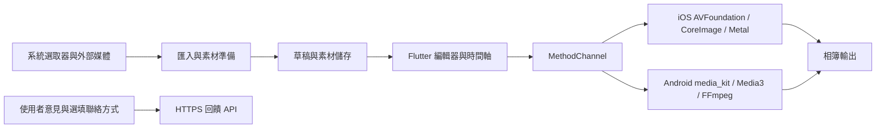

# App 安全、架構、可靠性與效能審查

> 此為修正前的基準報告。2026-09-27 的實作、驗證結果與尚未結案項目，請見 [修正紀錄](APP_REMEDIATION_2026_09_27.md)。

日期：2026-09-26。基準：Git `ca7f42a`，App `1.1.0+18`。環境：Windows、Flutter 3.44.8、Dart 3.12.2。

本次發現需要修正的資安缺陷，以及已重現的草稿資料遺失問題。建議先處理正式版簽章、草稿保存／清理、外部檔名處理，再處理記憶體與架構拆分。尚未證明有可從網際網路直接攻入 App 的 P0 漏洞；這不代表已通過完整滲透測試。

這次只新增審查報告與獨立重現程式，沒有修改產品程式、升級依賴、重設快照基準或操作正式交易。

## 範圍與判讀方式

- 盤點 603 個 Git 追蹤檔；主要程式目錄約 90,295 行 Dart／Swift／Objective-C／Kotlin。以入口、信任邊界、資料生命週期、媒體管線、原生橋接及發版設定為主軸追查，並非宣稱每一行都經過形式驗證。
- 檢查 Flutter UI／service／model、Android／iOS 原生實作、兩個本地 plugin fork、權限與備份設定、相依版本、原生二進位、CI、付款與回饋 API 呼叫。
- 執行靜態分析、全套 Flutter 測試、失敗項重跑、效能測試、實際桌面 FFmpeg 測試及四個邊界重現案例。
- **P1**：應先修正，避免正式發版或正常操作造成重大問題。**P2**：排入近期修正。這是此 App 的修正優先順序，不等同 CVSS 分數。
- 「已重現」表示執行了受控測試；「程式確認」表示從可達呼叫與實作確認缺陷；「待驗證」表示仍需真機、後端或供應商資訊確認影響。

## 主要發現

| 編號 | 優先度 | 問題 | 證據狀態 |
|---|---|---|---|
| R01 | P1 | Android release 使用 debug 簽章 | 設定確認；既有 APK 憑證確認 |
| R02 | P1 | 工作檔清理可刪掉草稿唯一剩餘素材 | 已重現 |
| R03 | P1 | 大素材草稿回報保存成功，實際仍依賴暫存檔 | 已重現儲存層行為；UI 呼叫鏈確認 |
| R04 | P2 | 本地 file_picker fork 含 Android 路徑穿越缺陷 | 程式確認；上游已有安全修正 |
| R05 | P2 | 外部檔名可改變 FFmpeg 參數解析 | 已使用實際套件 parser 重現 |
| R06 | P2 | 重複保存能突破草稿素材容量限制 | 已重現 |
| R07 | P2 | Metal 圖片／GIF 記憶體缺少總額控制，dispose 未清 GIF | 程式確認；真機峰值待測 |
| R08 | P2 | 音訊波形全檔解碼、無併發上限、主 isolate 遍歷 | 程式確認；長音訊真機壓測待做 |
| R09 | P2 | OS 備份範圍未明訂，與本機媒體隱私敘述有落差 | 設定確認；實際備份待測 |
| R10 | P2 | 內購交易監聽綁在斗內頁生命週期 | 程式確認；商店沙盒情境待測 |
| R11 | P2 | 原生媒體依賴與下載完整性未納入完整管控 | 二進位／建置腳本確認；漏洞可達性待逐項判定 |

### R01 — Android 正式建置仍用 debug key

位置：[build.gradle.kts:32](C:/Users/lesuc/OneDrive/文件/markcut/android/app/build.gradle.kts:32)。`release.signingConfig` 明確指向 `debug`，Android CI 也未提供正式簽章配置。

既有 `build/app/outputs/flutter-apk/app-arm64-v8a-release.apk` 的簽章者為 `C=US, O=Android, CN=Android Debug`。該檔日期為 2026-09-04，是既有產物，不是本次重新建置的 HEAD。憑證 SHA-256：`ca62c7af6ea6b6a57d25f299afa0c071e51bb87089cd48b583e35dc61483cf22`。

影響是正式簽章身分、金鑰管理、商店提交與後續更新鏈不可靠。這不表示知道 debug keystore 常見密碼的人就能憑空取得這把私鑰。Android 官方要求正式發行使用合適的 release signing；debug 憑證不是正式發行配置。[Android app signing](https://developer.android.com/studio/publish/app-signing)

修正：以 CI 安全變數／安全檔案配置 release key；缺少憑證直接讓建置失敗；不得回退到 debug。先確認已發行版本的憑證身分與更新相容性，再決定金鑰切換流程。

驗收：新建 APK／AAB 驗證簽章，確認不是 Android Debug；同一正式版本的更新安裝與商店測試軌流程成功。

### R02 — LRU 清理會刪除草稿唯一備份

位置：[work_files.dart:869](C:/Users/lesuc/OneDrive/文件/markcut/lib/services/work_files.dart:869)。工作檔超過 1,500 MiB 時按時間刪除；只避開正在寫入的檔案，沒有排除草稿仍引用的素材，也沒有保護「原始檔已消失，只剩工作檔」的情況。前段雖保留這類索引，總量清理仍會刪除它。

新素材處理完成後會自動呼叫 `sweep()`，因此使用者繼續匯入影片就可能觸發，並不需要按清除草稿。`holdSweep` 主要保護匯出期間，不能保護已保存的草稿。

重現：建立有草稿引用、原檔不存在的舊工作檔，再放入造成超額的新工作檔；執行真實 `WorkFiles.sweep()` 後，舊檔消失。大型 fixture 使用稀疏檔，不實際配置 1.5 GiB，測完清除。

修正：將「可重新產生的快取」與「草稿唯一素材」分開管理。從草稿及進行中的工作取得引用集合，清理前 pin 住必要檔案；只有確認可重新建立的檔案才可按 LRU 回收。容量不足應回報可理解的錯誤，不能默默犧牲既有草稿。

驗收：原檔移除、跨重啟、快取超額、正在預覽及匯出等組合下，所有已承諾保存的草稿仍可重新開啟與匯出。

### R03 — 保存成功不代表素材已持久保存

位置：[draft_assets.dart:149](C:/Users/lesuc/OneDrive/文件/markcut/lib/services/draft_assets.dart:149)、[batch_watermark_screen.dart:325](C:/Users/lesuc/OneDrive/文件/markcut/lib/screens/batch_watermark_screen.dart:325)、[collage_screen.dart:454](C:/Users/lesuc/OneDrive/文件/markcut/lib/screens/collage_screen.dart:454)。

單檔超過 40 MiB、整份素材超過 300 MiB，或複製失敗時，`secureAll()` 退回來源路徑。批次與拼圖的保存流程仍將這些路徑寫入草稿並回傳成功。當來源是 picker 的 cache／tmp 複本，OS 清理後就無法恢復；批次影片超過 40 MiB 是合理使用情境。

重現：把測試單檔上限縮為 100 bytes，提供 101-byte 素材；回傳的仍是來源路徑。刪掉暫存來源後，`DraftAssets.resolve()` 回傳 null。這是儲存層的真實程式執行，不是模擬另一份實作。

修正：回傳每個素材的持久保存結果，明確區分 durable／temporary／failed。草稿「完整保存成功」必須以素材確實可恢復為前提。大型素材可採持久化來源授權或正式素材庫；無法保存時提供明確說明與重新連結流程。

驗收：大於 40 MiB 的批次影片、整份超額、磁碟不足、來源被清理後，保存狀態與恢復結果一致，不可出現成功後才發現素材全失效。

### R04 — file_picker 本地 fork 存在路徑穿越

位置：[FileUtils.kt:385](C:/Users/lesuc/OneDrive/文件/markcut/packages/file_picker/android/src/main/kotlin/com/mr/flutter/plugin/filepicker/FileUtils.kt:385)、[FileUtils.kt:516](C:/Users/lesuc/OneDrive/文件/markcut/packages/file_picker/android/src/main/kotlin/com/mr/flutter/plugin/filepicker/FileUtils.kt:516)。

Android `ContentProvider` 回傳的 `DISPLAY_NAME` 直接拼到 cache 路徑，沒有移除 `../` 或檢查 canonical path。匯入音訊仍會走這個 plugin，因此不是純粹留在 repo 的死碼。

在本 App 的使用流程中，使用者需從可控制名稱的提供者選入內容；惡意提供者可令外掛在 App 自己的可寫沙盒內、預定 cache 目錄之外建立檔案／目錄。`if (!file.exists())` 會阻止覆寫既有檔案；這裡沒有證據可以突破 OS 沙盒或直接遠端執行程式。

這與 CVE-2026-38093 的缺陷一致。上游 11.0.2 changelog 記載路徑穿越修正；公開 advisory 的嚴重度為 Low／3.3，且尚未建立套件映射，不能期待一般 dependency scan 自動抓到。[上游問題](https://github.com/vicajilau/flutter_file_picker/issues/1967)、[上游 changelog](https://pub.dev/packages/file_picker/changelog)、[advisory](https://github.com/advisories/GHSA-r2rg-pm28-j8gw)

修正：使用 App 產生的不透明檔名儲存，原始名稱只作顯示；寫入前驗證 canonical destination 位於指定目錄。`pubspec.yaml` 使用 `dependency_overrides` 指向本地 fork，單改依賴版本號無法修掉實際程式，應移植安全修正或整合新版並保留必要客製功能。

驗收：以測試 ContentProvider 回傳 `../`、多層路徑、特殊字元與重名檔案，所有寫入均留在指定目錄，既有檔案不受影響。

### R05 — FFmpeg 字串命令沒有安全保留檔名界線

位置：[waveform_decode_io.dart:14](C:/Users/lesuc/OneDrive/文件/markcut/lib/services/waveform_decode_io.dart:14)、[video_engine_io.dart:1055](C:/Users/lesuc/OneDrive/文件/markcut/lib/services/video_engine_io.dart:1055)、[MainActivity.kt:329](C:/Users/lesuc/OneDrive/文件/markcut/android/app/src/main/kotlin/com/idoluidoluidolu/watermark/MainActivity.kt:329)。多處把外部路徑放進 `"$path"`，再交給 `FFmpegKit.execute(String)`。

Android 匯入檔名只替換 `/`，沒有移除雙引號；FFmpegKit 會自行解析整條字串。測試將含引號的檔名交給實際 `FFmpegKitConfig.parseArguments`，結果從一個輸入參數變成兩個 `-i`，另產生 `-f lavfi`。測試只解析參數，沒有執行惡意媒體處理。

因此已確認「參數邊界可被檔名改變」。普通帶引號的檔名也可能令匯出失敗；更嚴重的輸入／輸出重導向效果取決於其他參數與檔案是否存在。本次未證明系統 shell RCE 或資料外傳，不應如此描述。

修正：全部改用 `executeWithArguments(List<String>)` 或對應參數陣列 API，讓路徑始終是一個 argument；包含 waveform、縮圖、reverse、音訊與 export fallback。對只接受本機媒體的工作，再按需求限制 protocol／demuxer 與處理時間。

驗收：空白、單雙引號、反斜線、Unicode 及看似 `-i` 的檔名，都只形成一個路徑參數；正常匯入、波形與匯出成功。

### R06 — 每次保存重設容量，舊複本不計入總額

位置：[draft_assets.dart:153](C:/Users/lesuc/OneDrive/文件/markcut/lib/services/draft_assets.dart:153)。每次 `secureAll()` 都把 budget 重設到最大值；只有 `copied == true` 才扣額度。已存在或已位於管理目錄的素材回報 `bytes: 0`，實際占用未納入。

重現：草稿額度 150 bytes、兩個素材各 80 bytes。第一次只保存第一個；再次保存時第一個不扣額度，第二個也被保存，實際占用變成 160 bytes。正式的 300 MiB 限制同樣不能約束多次保存後的保留量。

修正：按草稿最終引用的唯一素材集合計算保留量，包含已存在檔案，並避免對重複引用重複計費；將單次 I/O 預算與實際儲存配額分開。與 R03 一起設計超額回饋，避免以默默失去持久性來解決配額。

驗收：連續保存、切換素材、重複引用、從管理目錄再選入，實際保留量及 UI 顯示均符合配額。

### R07 — Metal 預覽紋理缺乏總額與完整釋放

位置：[AppDelegate.swift:12737](C:/Users/lesuc/OneDrive/文件/markcut/ios/Runner/AppDelegate.swift:12737)、[AppDelegate.swift:12099](C:/Users/lesuc/OneDrive/文件/markcut/ios/Runner/AppDelegate.swift:12099)、[AppDelegate.swift:13761](C:/Users/lesuc/OneDrive/文件/markcut/ios/Runner/AppDelegate.swift:13761)。

目前 layout 會為 stillSpecs 的圖片建立全解析度紋理，沒有依預覽尺寸縮圖或依播放時間窗限制；GIF 可預先載入 96 幀，單張 GIF 雖有限制，所有 GIF 合計沒有統一 GPU 配額。RGBA 12MP 圖片的單份像素資料約 46 MiB；96 張 512×512 RGBA 紋理約 96 MiB，尚未包含其他解碼、渲染與 driver 成本。這些是容量推估，不是真機量測值。

`MetalPreviewEngine` 是單例；`disposeAll()` 清除了 stillTextures 等容器，卻沒有清 `gifAnims`。離開編輯器後仍可能保留上一份專案的 GIF 紋理，直到之後 layout 清理；記憶體警告處理也沒有對這些 Metal 紋理做完整回收。

修正：補齊 GIF disposal；在解碼前依目標尺寸 downsample；設 CPU／GPU 合計預算、播放時間窗與 LRU；GIF 採有限 frame window。預算與 active session 的所有權要一致。

驗收：真機連續開關多份含 GIF／大照片的專案後，記憶體回落到穩定區間；記憶體警告與背景切換後仍能恢復。用 Instruments 同時觀察 allocations／Metal，不能只看 Dart heap。

### R08 — 波形工作量與併發沒有被有效限制

位置：[waveform_cache.dart:23](C:/Users/lesuc/OneDrive/文件/markcut/lib/services/waveform_cache.dart:23)、[waveform_decode_io.dart:14](C:/Users/lesuc/OneDrive/文件/markcut/lib/services/waveform_decode_io.dart:14)、[timeline_editor.dart:1498](C:/Users/lesuc/OneDrive/文件/markcut/lib/widgets/timeline_editor.dart:1498)。

每個新音檔都立即啟動 FFmpeg，將全長音訊轉為 8 kHz／16-bit／mono PCM，再 `readAsBytes()` 讀入整份，最後在呼叫端 isolate 上遍歷樣本。6000 格只限制結果大小；12 筆 LRU 只限制已完成結果，兩者都不能限制同時進行的解碼與輸入記憶體。

一小時 PCM 約 55 MiB，多軌可同時產生多份；使用者只剪取幾秒仍分析全檔。離開專案後沒有對應工作取消，失敗輸出的清理也不完整。

修正：設置 1–2 個工作槽、取消與去重；串流累積 peak buckets，或在背景 isolate／原生端處理；避免完整 PCM 常駐；依來源版本及分析區間建立 cache key；以 finally 收尾暫存。

驗收：多個長音檔、快速刪除素材／離頁、失敗解碼下，併發與記憶體有可量測上限，UI 不被樣本遍歷卡住，暫存不持續累積。

### R09 — 媒體備份策略與隱私說明需對齊

位置：[AndroidManifest.xml:8](C:/Users/lesuc/OneDrive/文件/markcut/android/app/src/main/AndroidManifest.xml:8)、[about_screen.dart:243](C:/Users/lesuc/OneDrive/文件/markcut/lib/screens/about_screen.dart:243)。

Android 未明訂 `allowBackup`／`fullBackupContent`／`dataExtractionRules`。草稿、素材複本與工作檔存在內部持久目錄；iOS 的主要 Application Support／Documents 媒體也未看到相應的排除備份策略。部分 picker 暫存有排除備份，不能推及其他目錄。

Android Auto Backup 預設涵蓋部分內部檔案與 preferences，受使用者設定、容量、系統與裝置搬移方式影響；iOS 亦有備份排除機制。因此不能直接把「App 不自行上傳媒體」等同於「媒體不會透過任何系統備份離開裝置」。本次未觀察或觸發實際雲端媒體上傳。[Android Auto Backup](https://developer.android.com/identity/data/autobackup)、[Apple backup guidance](https://developer.apple.com/documentation/foundation/optimizing-your-app-s-data-for-icloud-backup)

修正：明確定義草稿、使用者素材、可重建快取各自的備份／搬移策略；將可重建大檔排除，並保留使用者需要的恢復能力。隱私敘述應區分 App 的上傳與使用者啟用的系統備份，避免一律停用備份反而造成資料遺失。

驗收：Android 雲端備份／裝置搬移及 iOS 備份恢復測試；確認恢復後路徑、索引與實際素材一致。

### R10 — 付款完成處理不應由頁面存活決定

位置：[donate_screen.dart:40](C:/Users/lesuc/OneDrive/文件/markcut/lib/screens/donate_screen.dart:40)、[donate_screen.dart:47](C:/Users/lesuc/OneDrive/文件/markcut/lib/screens/donate_screen.dart:47)。`purchaseStream` 在進入斗內頁才監聽，離頁即取消；pending 交易允許使用者離開。若交易延遲完成或 App 重新開啟卻未進斗內頁，沒有常駐流程接收與完成交易。

可能造成漏顯示完成、未完成 acknowledgement／finish，或依商店規則退款。官方套件建議儘早監聽交易，並完成 pending purchase；Android 有完成時限要求。[in_app_purchase documentation](https://pub.dev/packages/in_app_purchase)

目前商品是小費，沒有看到以付款解鎖敏感權限的機制，因此沒有把「缺少伺服器 receipt 驗證」誇大為付費功能繞過。

修正：由 App 級 PurchaseService 持有監聽、重試與冪等完成；頁面只顯示狀態。處理 `completePurchase` 的例外與重啟後補單。

驗收：商店沙盒中測試 pending 後離頁、殺 App、隔日完成、取消及完成重試；未回斗內頁也能正確收尾。

### R11 — Pub 掃描看不到完整原生供應鏈

`flutter pub outdated` 列出 53 個可更新套件，但 advisory 欄位為 0。對 141 筆 Pub 套件名稱／版本查詢 OSV 也沒有命中。R04 的真實缺陷仍存在，說明「0 告警」只代表該資料庫與套件映射沒有匹配，不能推論無漏洞。本地 fork 也需要獨立審查。

Android 同時存在兩套 FFmpeg：

| 路徑 | 本次確認 |
|---|---|
| FFmpegKit 匯出 | 2.5.2 套件對應的 Android AAR 內二進位顯示 `n8.1.2`；不能只因 POM 描述寫 8.1.1 就判成 8.1.1 |
| media_kit／libmpv 預覽 | `media_kit_libs_android_video 1.3.8` 下載 v1.1.7 JAR；實際 `libmpv.so` 內含 `n6.0`，上游同 tag 建置清單列 FFmpeg 6.0、libxml2 2.10.3 |

JAR 的 MD5 與套件釘住的值一致：`83df25b61193af8fa815e373143ac9af`；其中 arm64 `libmpv.so` SHA-256：`adf83fde58a9f6751ce6e83b9b187f651425d53ec0e20da04deb8dfb4aa775e1`。這是實際快取 artifact 的辨識資料，不是所有已安裝版本的遠端證明。[上游 v1.1.7 依賴清單](https://raw.githubusercontent.com/media-kit/libmpv-android-video-build/v1.1.7/buildscripts/include/depinfo.sh)

舊 native stack 接收外部媒體，應優先建立其安全修補清單。不過此 libmpv 有裁剪 codec／demuxer；必須比對啟用元件與供應商 backport，不能把所有 FFmpeg CVE 都判為本 App 可利用。升級匯出用 FFmpegKit 不會自動更新預覽用 libmpv。[FFmpeg security fixes](https://ffmpeg.org/security.html)

另一個缺口：FFmpegKit 的 iOS 安裝腳本以 HTTPS 下載 release ZIP，只檢查 ZIP 可解壓，未驗證獨立釘住的 SHA-256／簽章。Pub lock 的 package hash 不涵蓋這次額外下載。repo 未追蹤 `Podfile.lock`，CI 也使用 `xcode: latest`／`cocoapods: default`，完整建置無法只靠 Pub lock 重現。沒有發現供應鏈已遭入侵的證據。

修正：建立 native SBOM 與實際二進位版本／修補紀錄；更新或自行維護預覽 stack；釘住原生下載的可信 hash、CocoaPods lock 與受測工具鏈；對 fork 維護安全同步清單。

驗收：乾淨環境產出可追溯的 native dependency inventory；下載被換檔必須失敗；每項適用 CVE 有已修正／不可達的可查證理由。

## 架構與現有防護評估

App 以本機媒體處理為主，沒有帳號／登入系統；外部網路業務主要是使用者主動送出的意見回饋與商店付款。主要信任邊界是「外部媒體／檔名進入 App」與「暫存何時被視為永久資料」，不只是 HTTP API。

已存在且值得保留的防護：

- 回饋 API 使用 HTTPS；未看到略過憑證驗證的程式或全域 ATS 放寬。介面也有說明意見與選填聯絡資訊會送到開發者伺服器。
- 相簿選擇主要使用系統 picker；Android launcher exported 是正常入口需求，沒有因此列成漏洞。
- BlobStore 使用暫存寫入後 rename、每個 key 串行化；部分 JSON 編碼移到背景處理。
- 媒體準備有排隊、取消與 in-flight 保護；Dart image cache、部分 GIF preview 與 bitmap 路徑已有預算。
- 儲存相簿遭拒絕時會回報失敗；部分 iOS 照片輸出會移除 GPS／IPTC metadata。
- 未找到產品程式把媒體自動上傳到回饋服務的呼叫；診斷分享是使用者觸發的流程。
- 已有大量資料恢復、編輯、匯出與效能測試，提供漸進重構的基礎。

架構主要負債是責任集中與資源所有權不清楚。`video_editor_screen.dart` 有 17,787 行，`AppDelegate.swift` 有 14,673 行，合計約占本次主要程式行數 36%。這本身不是漏洞，但畫面狀態、工作排程、資產生命週期及平台後端集中，會使小修改牽動多條路徑。

建議漸進拆分，不做一次性全面重寫：

1. 優先抽出 AssetRepository／DraftRepository，統一持久性、引用、配額、清理與恢復，先消除 R02／R03／R06。
2. 用 ExportJob／PreviewSession 管理取消、資源與生命週期，取代跨頁面全域旗標與不明確的 singleton 持有。
3. 將 Swift 的 preview、export、photo save、media probe 拆成可獨立測試的元件；Dart 畫面僅保留互動協調。
4. 為 MethodChannel 建立型別化 DTO／Pigeon 契約與版本驗證；預覽與匯出共用幾何、時間及色彩規則，減少多後端邏輯漂移。
5. 縮小 timeline／preview 的 rebuild 邊界，以局部 notifier 驅動高頻變化；統一記憶體與暫存觀測指標。

CI 方面，兩條 iOS workflow 有 analyze／test gate，但 Android workflow 直接 build APK，沒有同等 gate。現行全套測試並非全綠；不能把 targeted rerun 通過視為原始失敗已修正。建議保存結構化測試結果、明確檢查 exit status，並在適用的平台執行固定環境的 golden tests。

## 實際執行結果

| 檢查 | 結果與限制 |
|---|---|
| `dart analyze lib test` | exit 0；1 個 info（函式宣告風格），無 error／warning |
| integration_test 與兩個本地 plugin 的 Dart 靜態分析 | 無問題；不等於 Swift／Kotlin 原生編譯完成 |
| 全套 `flutter test --no-pub --reporter expanded` | **1,053 通過、8 略過、8 失敗**；約 7 分 48 秒 |
| 功能失敗項定向重跑 | 兩個檔案共 5 項通過；原本失敗的 4 項恢復通過，顯示存在時序／共享環境敏感性，原因仍需追查 |
| Golden 定向單 worker 重跑 | 2 通過、4 仍失敗；未更新基準圖 |
| 四個新增邊界 probe | 4 通過，表示四個預期缺陷成功重現，**不是缺陷已修好** |
| `MARKCUT_BENCH=1` 三組既有 benchmark | 12 通過；Windows debug／部分原生 mock，不能當手機 release 效能 |
| 編輯器 rebuild 單檔重測 | 1 通過；數值見下表 |
| 實際桌面 FFmpeg GIF timing 測試 | 5 通過，包含 trim／speed／reverse／loop／分段輸出驗證 |
| 相依更新／OSV | 53 個套件有新版；141 筆 Pub 版本查詢 0 命中，未完整涵蓋原生相依 |
| 追蹤檔敏感字串掃描 | 私鑰／常見 token／憑證模式未命中；不是完整歷史祕密鑑識，也不保證任意格式憑證不存在 |

持續失敗的畫面測試：`export_tab_golden_test.dart` 兩項、`gif_golden_test.dart` 加素材選單一項、`reorder_sheet_golden_test.dart` 一項。差異約 0.05–0.07%，需人工確認是渲染基準漂移還是介面回歸，不應直接接受新圖。

效能結果：

| 測量 | 本機結果 | 解讀 |
|---|---|---|
| editor 整頁 setState + pump | median 27.91 ms、p90 43.42 ms；重建 671 elements | 有縮小 rebuild 範圍的價值，不能直接等同真機掉幀數 |
| 單指拖曳 | median 2.59 ms、p90 3.73 ms | 目前這條互動的局部更新比整頁更新輕 |
| 雙指 pinch | median 3.47 ms、p90 6.47 ms | 同上，仍需真機 GPU 驗證 |
| 30 份草稿 profile 捲動 | median 3.27 ms、p90 6.66 ms；40 frames 無超過 16.7 ms | 此 fixture 下表現良好 |
| 1080×1920 overlay 六次 render | baseline 1,158 ms，使用 cache 169 ms，輸出一致 | 既有重用方向有效，應保留 |
| 8.3MP 圖片 PNG 編碼階段 | 約 3.2–4.1 秒 | Windows fallback 路徑的主要成本；不能推論 iOS 原生輸出同速 |

主要效能工作順序應是 Metal 資源生命週期、waveform 有界處理、整頁 rebuild，再評估原生輸出／PNG 的資料交換；不建議只為抽象的「乾淨架構」先重寫整個 renderer。

## 證據與重現檔案

測試輸出與 probes 保存在 [本機 audit 目錄](C:/Users/lesuc/OneDrive/文件/markcut/build/audit_2026_09_26)。此目錄位於被 Git 忽略的 build 下，不是正式 CI 測試的一部分，執行 clean 可能刪除它。

- [boundary_probe_test.dart](C:/Users/lesuc/OneDrive/文件/markcut/build/audit_2026_09_26/boundary_probe_test.dart)：真實 FFmpegKit parser、暫存素材遺失、重複保存超額、workfile sweep 四項。
- [tests.log](C:/Users/lesuc/OneDrive/文件/markcut/build/audit_2026_09_26/tests.log)：原始全套測試；[retest.log](C:/Users/lesuc/OneDrive/文件/markcut/build/audit_2026_09_26/retest.log) 與 [golden-retest.log](C:/Users/lesuc/OneDrive/文件/markcut/build/audit_2026_09_26/golden-retest.log)：定向重跑。
- [bench.log](C:/Users/lesuc/OneDrive/文件/markcut/build/audit_2026_09_26/bench.log)、[editor-bench-isolated.log](C:/Users/lesuc/OneDrive/文件/markcut/build/audit_2026_09_26/editor-bench-isolated.log)：效能數據。
- [outdated.json](C:/Users/lesuc/OneDrive/文件/markcut/build/audit_2026_09_26/outdated.json)、[osv_summary.json](C:/Users/lesuc/OneDrive/文件/markcut/build/audit_2026_09_26/osv_summary.json)：相依掃描結果。

可從專案目錄重跑 `flutter test --no-pub build/audit_2026_09_26/boundary_probe_test.dart --reporter expanded`。這些 probe 目前斷言的是缺陷存在；修正時應轉為正常行為的 regression tests，不能原封不動當成驗收標準。

## 修正順序與仍未涵蓋的部分

第一批：R01 正式簽章、R02／R03 草稿資料完整性、R04／R05 外部檔名邊界；R06 與草稿修正同批處理。第二批：R07／R08 記憶體及工作併發、R10 交易生命週期、R11 原生依賴盤點與可信建置。再補 R09 備份／隱私一致性及 CI 穩定性，最後漸進拆分大型模組。

沒有連接 Android 真機，Windows 也無法完成 iOS 原生建置與 Instruments 測量；未執行手機端整合測試、商店沙盒付款、惡意 ContentProvider 的裝置端完整利用、長時間壓測、雲端備份恢復或媒體 decoder fuzzing。APK 簽章檢查用的是既有產物，不是本次 fresh release。

repo 只有對 `https://api.twconcertview.com/api/app-feedback/` 的 App 呼叫，未包含後端原始碼與部署設定。因此服務端的輸入驗證、限流、資料庫／管理員權限、保存期限與日誌保護尚未完成審查；前端字數限制不能代替後端驗證，也不能僅憑公開回饋端點就宣稱缺少登入是漏洞。取得後端專案後才可補上這一部分。
